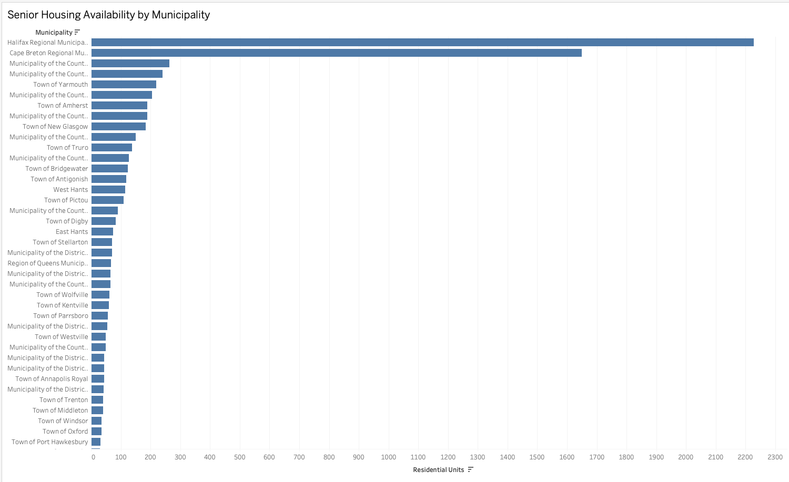
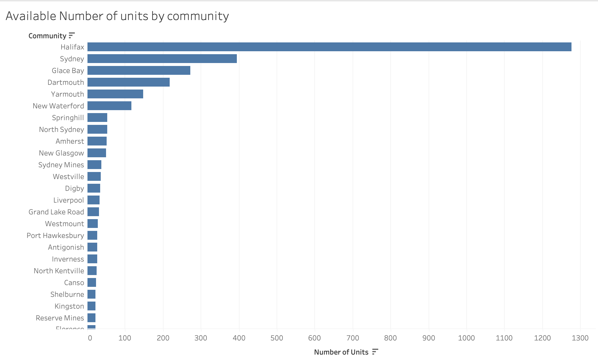
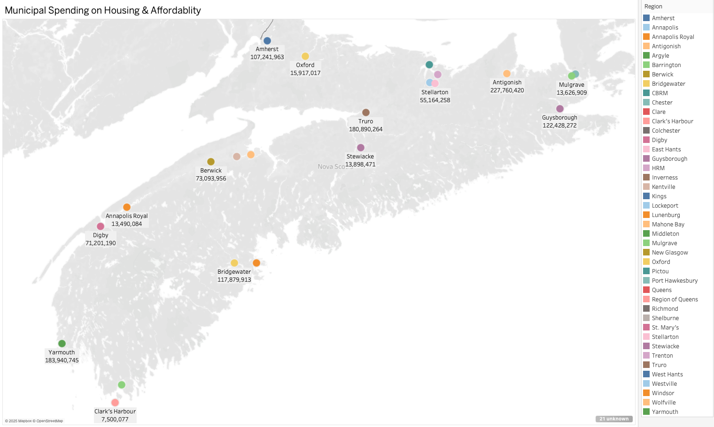
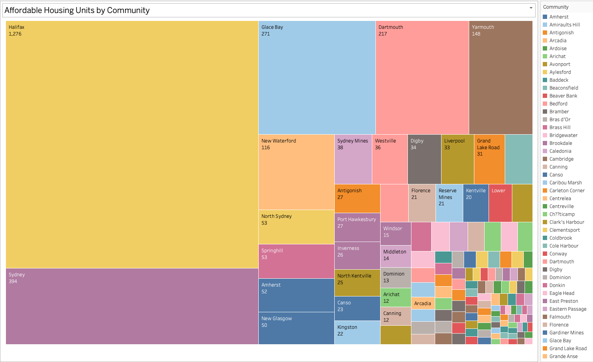
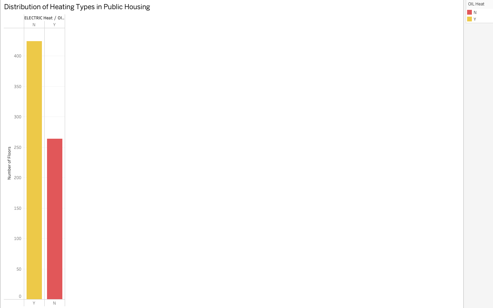
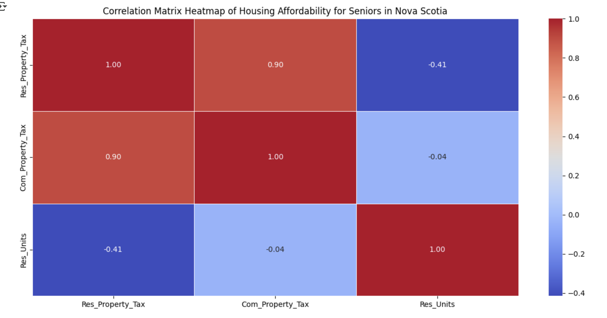
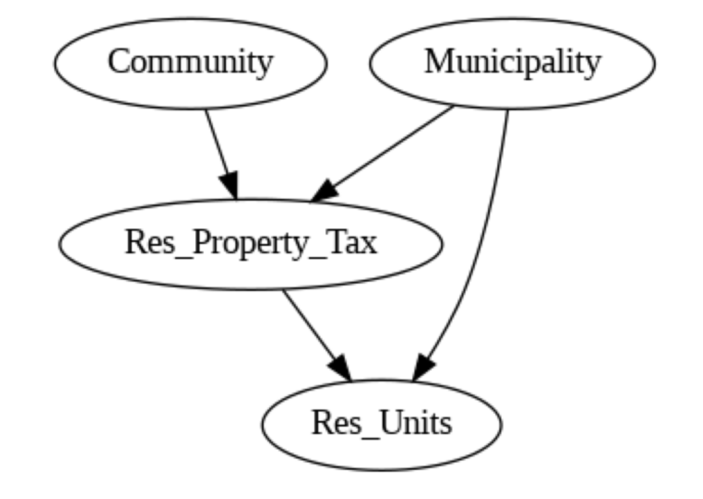

# Affordable Housing for Seniors in Nova Scotia
*A Data-Driven Analysis*

*By: Kolawole Amos Oguntade*

# Executive Summary
Housing affordability for seniors has become a critical issue in Nova Scotia, mirroring national trends of aging populations facing financial constraints. Many seniors rely on fixed incomes such as pensions, making it difficult to afford market-rate housing. The availability of public housing is vital to ensuring that seniors have access to safe, stable, and affordable accommodations. However, limited supply, increasing demand, and long wait times raise concerns about the effectiveness of government housing programs.
This data-driven study will analyze public housing availability, affordability trends, and government interventions for seniors in Nova Scotia. Using datasets from Public Housing Units - Nova Scotia Seniors, Municipal Fiscal Statistics, and CMHC Rental Market Data, this study aims to provide actionable insights into senior housing affordability and policy effectiveness.

[For a deeper understanding, Read detailed Background](Background.md)

[Find the visualizations Here](IMG)

[Find the Datasets Here](Data)

# Key Performance Indicators (KPIs)
To assess housing affordability in Nova scotia, the following five key performance indicators (KPIs) will be analyzed:
1.	Senior Housing Availability by Municipality
- Total number of senior housing units in each municipality.

2. Public Housing Units vs. Demand
- The number of senior public housing units to the total senior population in each municipality.

3. Municipal Spending on Housing & Affordability Initiatives
- Analyze how much each municipality spends on housing and affordability programs.

4. Affordability Index (Housing Costs vs. Income Levels)
- Compare housing costs with average household income.

5. Heating & Utility Support in Public Housing
- The distribution of heating types and access to public water and sewer services in public housing units.

# Analysis

1. Senior Housing Availability by Municipality : A bar chart showing the total number of public housing units for seniors across municipalities.
  

2. Public Housing Units vs. Demand : A chart displaying the top 15 communities with the most public housing units for seniors.

3. Municipal Spending on Housing & Affordability : Visualization of the total expenses by municipalities on housing and affordability programs.

4. Affordability Index (Housing Costs vs. Income Levels) : A bar chart highlighting the top 15 communities with the most affordable housing units.

5. Heating & Utility Support in Public Housing : A comparison of heating types (Oil vs. Electric) in public housing units, showing the number of units relying on each.

# Causal Inference Summary
This analysis explored how residential property taxes, commercial property taxes, and municipal attributes influence the number of residential units available—specifically within the context of housing affordability for seniors in Nova Scotia.

1. Quantitative strength of relationships (Heatmap)

We observe a moderate negative correlation (-0.41) between residential property tax (Res_Property_Tax) and the number of residential units (Res_Units). This suggests that as residential property taxes increase, the availability of residential units—including public and affordable housing—may decrease. This aligns with the expectation that higher property taxes could deter investment in new housing developments or strain affordability, particularly for seniors on fixed incomes.

2. Theoretical flow of causality (Causal Graph)

This diagram further reinforces this relationship by showing Community and Municipality as upstream factors influencing Res_Property_Tax, which in turn directly affects Res_Units. This suggests that structural and regional differences in policy—especially related to taxation—can shape housing availability outcomes.

Interestingly, commercial property tax (Com_Property_Tax) showed a strong positive correlation (0.90) with Res_Property_Tax, but only a very weak negative correlation (-0.04) with Res_Units. This indicates that while the two tax categories are closely linked (likely reflecting general tax policy), commercial property taxes do not significantly impact senior housing availability.

# Refute Analysis Interpretation
This means we are testing the robustness of the original causal effect estimate by adding a random variable that could act like a confounder (i.e., a variable that influences both the cause and the effect).

Estimated Effect: 2.5655112856348694e-07
This is the original estimate of the causal effect before adding the random common cause. It represents a very small positive effect (on the order of ~0.00000026).

New Effect: 2.4537120902572934e-07
After adding the random common cause, the effect size changed slightly—it decreased a bit to ~0.00000025. This change is very minor, suggesting the estimate is stable.

p-value: 0.54
A p-value of 0.54 is quite high, meaning there is no statistically significant difference between the original effect and the new effect after adding the random variable. In other words, the change is likely due to chance.

# Conclusion

These findings suggest a potential causal pathway from municipal structure and community tax policy to the availability of residential housing units for seniors. Importantly, the negative relationship between residential property taxes and housing availability highlights the need for targeted tax relief policies or housing subsidies to ensure affordability, particularly for vulnerable senior populations. Future work should further investigate how these relationships evolve across more municipalities with broader data coverage.

