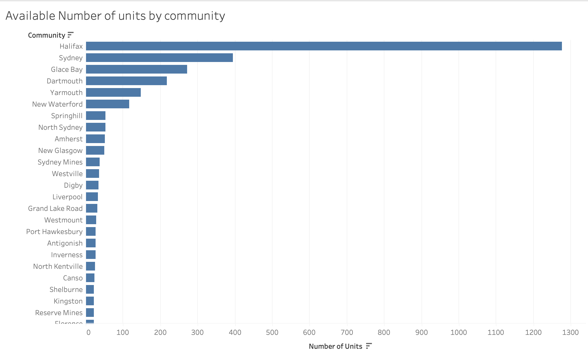

# Affordable Housing for Seniors in Nova Scotia
*A Data-Driven Analysis*

*By: Kolawole Amos Oguntade*

# Executive Summary
Housing affordability for seniors has become a critical issue in Nova Scotia, mirroring national trends of aging populations facing financial constraints. Many seniors rely on fixed incomes such as pensions, making it difficult to afford market-rate housing. The availability of public housing is vital to ensuring that seniors have access to safe, stable, and affordable accommodations. However, limited supply, increasing demand, and long wait times raise concerns about the effectiveness of government housing programs.
This data-driven study will analyze public housing availability, affordability trends, and government interventions for seniors in Nova Scotia. Using datasets from Public Housing Units - Nova Scotia Seniors, Municipal Fiscal Statistics, and CMHC Rental Market Data, this study aims to provide actionable insights into senior housing affordability and policy effectiveness.

[For a deeper understanding, Read detailed Background](Background.md)

# Key Performance Indicators (KPIs)
To assess housing affordability in Nova scotia, the following five key performance indicators (KPIs) will be analyzed:
1.	Senior Housing Availability by Municipality
- Total number of senior housing units in each municipality.

2. Public Housing Units vs. Demand
- The number of senior public housing units to the total senior population in each municipality.

3. Municipal Spending on Housing & Affordability Initiatives
- Analyze how much each municipality spends on housing and affordability programs.

4. Affordability Index (Housing Costs vs. Income Levels)
- Compare housing costs with average household income.

5. Heating & Utility Support in Public Housing
- The distribution of heating types and access to public water and sewer services in public housing units.

 
  
